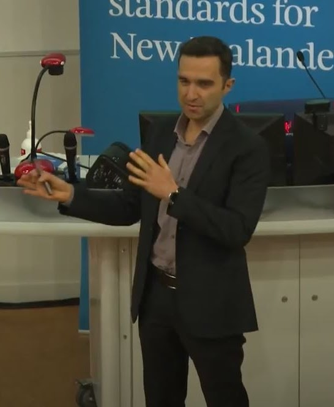

Murat Özbilgin

<!-- 

Senior Research / Technical Economist  
Bank of England

 -->

I am a **Senior Research Economist** at the **Bank of England**. 

<!-- I am a macroeconomist working on structural macroeconomic modelling, DSGE models, overlapping-generations models, labour markets, and policy-relevant quantitative analysis. -->

Previously, I worked at the New Zealand Treasury, the Reserve Bank of New Zealand, and the Central Bank of Turkiye.  

I hold a **PhD** from **University of California, Santa Barbara**.  

## Research Interests

- Fiscal/monetary policy interactions  
- Macroeconomic policy implications of demographic change  
- Labour market and wage dynamics  
- Short-term and long-term forecasting

## New publications {.highlight-box}
- [New Zealand Treasury Media Statement (30 March 2026)](https://www.treasury.govt.nz/publications/media-statement/four-long-term-fiscal-statement-background-papers-published): Four Long-term Fiscal Statement background papers published
- An Overlapping Generations Model to Investigate the Fiscal Implications of New Zealand's Ageing Population (March 2026, New Zealand Treasury WP 26/01) [Full detail](workingpapers.html)
- Raising Taxes to Fund Health and Pensions in an Ageing New Zealand - Alternative Tax Bases (March 2026, New Zealand Treasury AN 26/03) [Full detail](workingpapers.html)
- Raising Taxes to Fund Health and Pensions in an Ageing New Zealand - Alternative Labour Tax Progressivity (March 2026, New Zealand Treasury AN 26/04) [Full detail](workingpapers.html)

## Links

- [CV](files/Short_CV_MuratOzbilgin.pdf)
- [Google Scholar](https://scholar.google.com/citations?user=aFMpS3YAAAAJ&hl=en)
- [LinkedIn](https://www.linkedin.com/in/muratozbilgin/)

<!-- ---
title: "Murat Ozbilgin"
title-block-style: none
---

I am a Senior Research Economist at the Bank of England. 

Previously, I worked at the New Zealand Treasury, the Reserve Bank of New Zealand, and the Central Bank of Turkiye.  

I hold a PhD from University of California, Santa Barbara.  

## Research Interests

Fiscal/monetary policy interactions  
Macroeconomic policy implications of demographic change  
Labour market dynamics  
Short-term and long-term forecasting

## Links

- CV
- Google Scholar
- LinkedIn
- GitHub -->